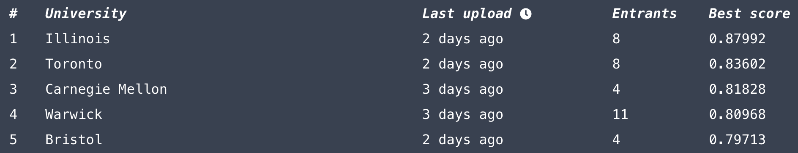
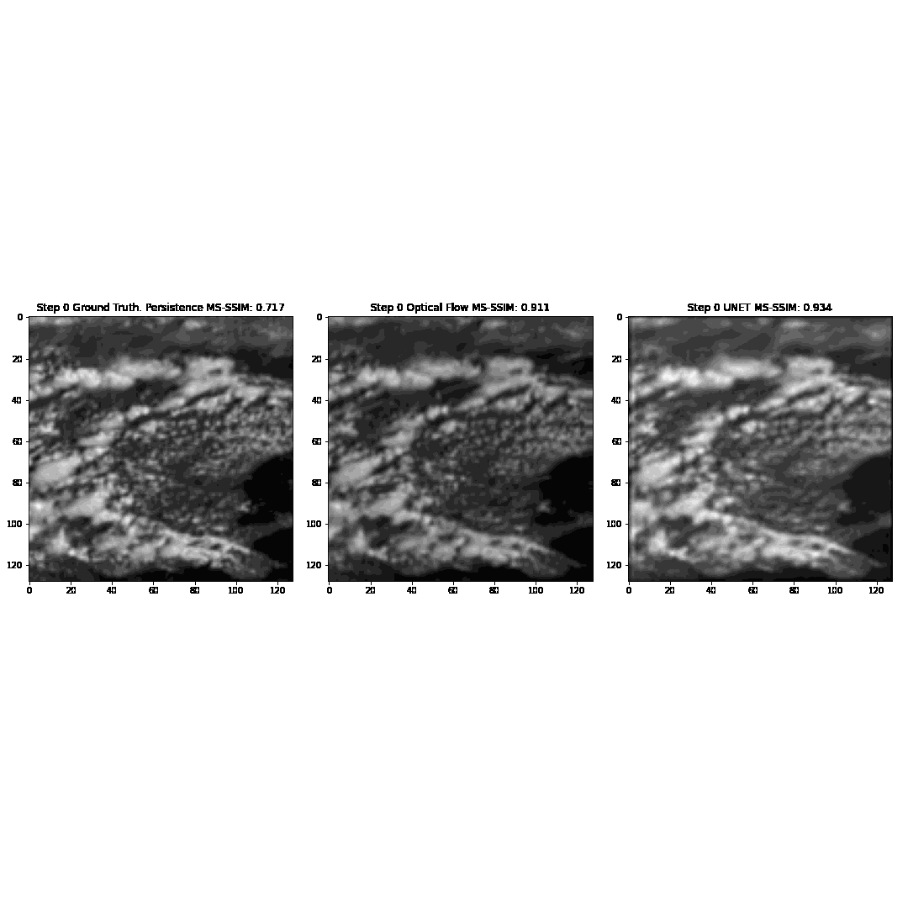

# Climatehack

This is the repository for Illinois's Climatehack Team. We earned first place on the [leaderboard](https://climatehack.ai/compete/leaderboard/universities) with a final score of 0.87992. 

<p align='center'>
    
</p>

An overview of our approach can be found [here](https://docs.google.com/presentation/d/1P_cv3R7gTRXG41wFPXT2lZe9E1GnKqtaJVqe-vsAvL0/edit?usp=sharing).

Example predictions:


# Setup
```bash
conda env create -f environment.yaml
conda activate climatehack
python -m ipykernel install --user --name=climatehack
```

First, download data by running `data/download_data.ipynb`. Alternatively, you can find preprocessed data files [here](https://drive.google.com/drive/folders/1JkPKjOBtm3dlOl2fRTvaLkSu7KnZsJGw?usp=sharing). Save them into the `data` folder. We used `train.npz` and `test.npz`. They consist of data temporally cropped from 10am to 4pm UK time across the entire dataset. You could also use `data_good_sun_2020.npz` and `data_good_sun_2021.npz`, which consist of all samples where the sun elevation is at least 10 degrees. Because these crops produced datasets that could fit in-memory, all our dataloaders work in-memory.


# Best Submission
Our best submission earned scores exceeding 0.85 on the Climatehack [leaderboard](https://climatehack.ai/compete/leaderboard). It is relatively simple and uses the `fastai` library to pick a base model, optimizer, and learning rate scheduler. After some experimentation, we chose `xse_resnext50_deeper`. We turned it into a UNET and trained it. More info is in the [slides](https://docs.google.com/presentation/d/1P_cv3R7gTRXG41wFPXT2lZe9E1GnKqtaJVqe-vsAvL0/edit?usp=sharing).

To train:
```bash
cd best-submission
bash train.sh
```

To submit, first move the trained model `xse_resnext50_deeper.pth` into `best-submission/submission`.
```bash
cd best-submission
python doxa_cli.py user login
bash submit.sh
```

Also, check out `best-submission/test_and_visualize.ipynb` to test the model and visualize results in a nice animation. This is how we produced the animations found in `figs/model_predictions.gif`.

# Experiments
We conducted several experiments that showed improvements on a strong baseline. The baseline was OpenClimateFix's skillful nowcasting [repo](https://github.com/openclimatefix/skillful_nowcasting), which itself is a implementation of Deepmind's precipitation forecasting GAN. This baseline is more-or-less copied to `experiments/dgmr-original`. One important difference is that instead of training the GAN, we just train the generator. This was doing well for us and training the GAN had much slower convergence. This baseline will actually train to a score greater than 0.8 on the Climatehack [leaderboard](https://climatehack.ai/compete/leaderboard). We didn't have time to properly test these experiments on top of our best model, but we suspect they would improve results. The experiments are summarized below:

Experiment | Description | Results |
--- | --- | --- |
DCT-Trick | Inspired by [this](https://proceedings.neurips.cc/paper/2018/file/7af6266cc52234b5aa339b16695f7fc4-Paper.pdf), we use the DCT to turn 128x128 -> 64x16x16 and IDCT to turn 64x16x16 -> 128x128. This leads to a shallower network that is autoregressive at fewer spatial resolutions. We believe this is the first time this has been done with UNETs. A fast implementation is in `common/utils.py:create_conv_dct_filter` and `common/utils.py:get_idct_filter`. | 1.8-2x speedup, small <0.005 performance drop |
Denoising | We noticed a lot of blocky artifacts in predictions. These artifacts are reminiscent of JPEG/H.264 compression artifacts. We show a comparison of these artifacts in the [slides](https://docs.google.com/presentation/d/1P_cv3R7gTRXG41wFPXT2lZe9E1GnKqtaJVqe-vsAvL0/edit?usp=sharing). We found a pretrained neural network to fix them. This can definitely be done better, but we show a proof-of-concept. | No performance drop, small visual improvement. The slides have an example. |
CoordConv | Meteorological phenomenon are correlated with geographic coordinates. We add 2 input channels for the geographic coordinates in OSGB form. | +0.0072 MS-SSIM improvement |
Optical Flow | Optical flow does well for the first few timesteps. We add 2 input channels for the optical flow vectors. | +0.0034 MS-SSIM improvement |

The folder `experiments/climatehack-submission` was used to submit these experiments.
```bash
cd experiments/climatehack-submission
python doxa_cli.py user login
bash submit.sh
```

Use `experiments/test_and_visualize.ipynb` to test the model and visualize results in a nice animation.
